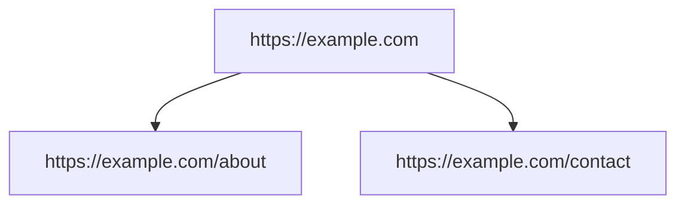

# Site Mapper (Experimental)

A utility bot that crawls a website starting from a given URL and prints:
- A list of discovered URLs grouped by depth.
- A Mermaid diagram of the site graph (copy/paste into any Mermaid renderer).
- Potential "unexposed" routes collected from `sitemap.xml`.

> Disclaimer: This tool is experimental. Its real-world usefulness on complex/internal sites has NOT been verified. Treat results as indicative only.

## Prerequisites
- Python environment set up per project root `README.md` / `docs/README.md`.
- Dependencies installed:
  ```bash
  pip install -r requirements.txt
  ```

## How to Run
- Basic crawl (depth 1, restrict to same domain):
  ```bash
  python app.py run site_mapper --params https://example.com 1 true
  ```
- Deeper crawl (depth 2):
  ```bash
  python app.py run site_mapper --params https://example.com 2 true
  ```

### Parameters
The bot signature is:
```
site_mapper.run(start_url: str, max_depth: int = 2, same_domain_only: bool = True)
```
- `start_url` (required): Starting page to crawl.
- `max_depth` (optional): Crawl depth (0 = only the start page).
- `same_domain_only` (optional): If `true`, only URLs on the same host are crawled.

### Output
The bot prints to stdout:
- "Site Map Summary" with per-depth URLs (status code and title when available), and the number of pages crawled.
- "Potential unexposed routes (from sitemap)" when `sitemap.xml` is found.
- A Mermaid graph you can paste into a renderer. Example:



No files are written by default. If you need persisted JSON/Markdown reports, open an issue or request an enhancement.

## Scope & Limitations
- Uses `requests + BeautifulSoup`; does not execute JavaScript. Dynamic menus/tabs may be missed.
- Respects a safety cap of ~200 pages. Adjusting this would require code changes.
- Only `sitemap.xml` is checked for additional routes. `robots.txt` is consulted to discover sitemap locations but is not enforced for allow/deny in this basic version.
- Same-domain restriction is recommended for intranets and authenticated portals.

## Tips
- For internal sites requiring login, consider exporting cookies or extending the bot to use Selenium with a login flow.
- Paste the Mermaid output into a Markdown viewer that supports Mermaid, or use https://mermaid.live.

## Disclaimer (Repeated)
- This tool is experimental and provided as-is. Its usefulness has **not** been validated across real intranet deployments. Use the results as a preliminary map and verify critical paths manually.
